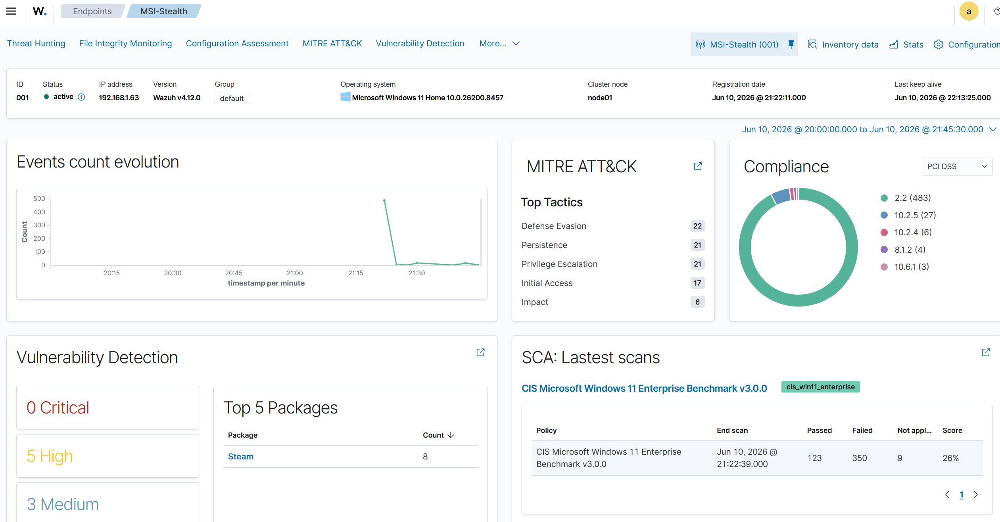
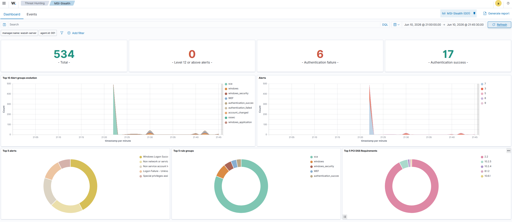
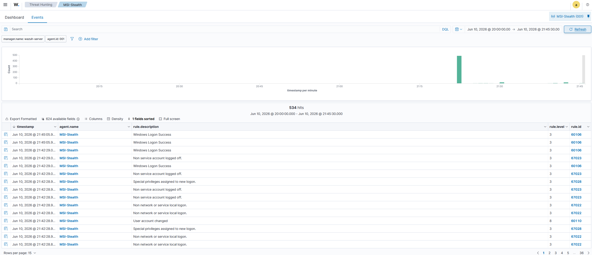
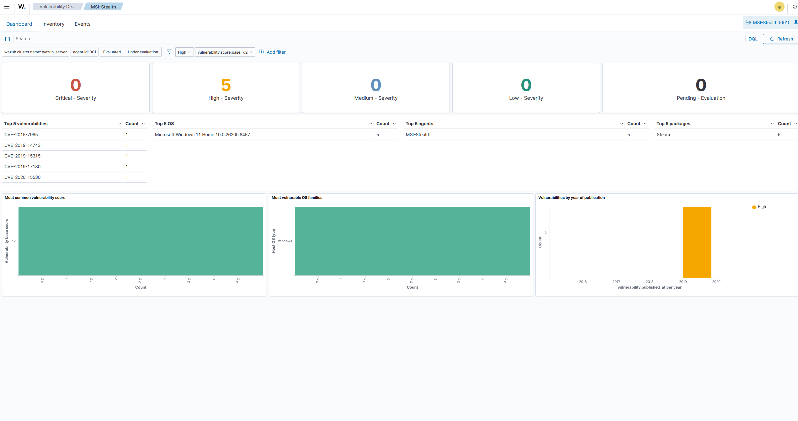

# Wazuh SIEM Home Lab
> Last updated: June 2026

## Objective

This lab deploys Wazuh as a SIEM platform in a home lab environment, covering agent-based log collection, real-time security event monitoring, vulnerability detection, and compliance assessment against the CIS Windows 11 Enterprise Benchmark. The objective is to build hands-on familiarity with the core workflows a Tier 1 SOC Analyst performs daily: ingesting endpoint telemetry, triaging alerts, identifying authentication-based threats, and assessing endpoint compliance posture.

Wazuh is widely deployed in UK security operations environments as an open-source alternative to commercial SIEM platforms. This lab covers the same detection and response capabilities at no cost.

## Environment

| Component | Spec |
|---|---|
| SIEM Host | MSI Stealth 16 (Core Ultra 9, 32GB DDR5) |
| Hypervisor | VMware Workstation Pro 26H1 |
| SIEM OS | Ubuntu 26.04 LTS |
| Wazuh Version | 4.12.0 (all-in-one: Manager, Indexer, Dashboard) |
| Monitored Endpoint | MSI Stealth 16 -- Windows 11 Home (agent: MSI-Stealth) |
| Network | Bridged -- 192.168.1.34 (SIEM VM), 192.168.1.63 (endpoint agent) |

## Architecture

```
  MSI Stealth 16 (Windows 11)
  +---------------------------------+
  | Wazuh Agent: MSI-Stealth        |
  | Collects: Windows Event Logs    |
  |           Vulnerability data    |
  |           CIS SCA scan results  |
  +---------------------------------+
              |
              | Port 1514 (agent traffic)
              | Port 1515 (agent registration)
              v
  VMware VM (Ubuntu 26.04 LTS) -- 192.168.1.34
  +---------------------------------+
  | Wazuh Manager                   |
  | Wazuh Indexer (OpenSearch)      |
  | Wazuh Dashboard (port 443)      |
  +---------------------------------+
              |
              v
  Browser on MSI: https://192.168.1.34
  Dashboard -- Alerts, Threat Hunting, Vulnerability Detection, SCA
```

## What I did

**1. Provisioned the SIEM VM**

Created an Ubuntu 26.04 LTS Server VM in VMware Workstation Pro with 6 vCPUs, 10GB RAM, and 80GB disk. Network adapter set to Bridged so the VM received a DHCP address on the 192.168.1.x LAN, making it directly reachable from other devices without NAT translation.

**2. Installed Wazuh all-in-one**

Used Wazuh's quickstart installation script to deploy Manager, Indexer, and Dashboard in a single pass:

```bash
curl -sO https://packages.wazuh.com/4.12/wazuh-install.sh && sudo bash ./wazuh-install.sh -a
```

The all-in-one deployment installs all three components on a single host, appropriate for a home lab or small deployment. The Wazuh Indexer is an OpenSearch-based storage and search engine; the Dashboard runs at https://[VM-IP]:443.

Note: Wazuh 4.12.0 installed successfully on Ubuntu 26.04 LTS despite the OS not appearing on the official supported list (which currently runs to 22.04). No installation errors were encountered.

**3. Deployed the Windows agent**

Enrolled a Windows 11 endpoint as a monitored agent via the Wazuh Dashboard deploy wizard. The wizard generates a PowerShell install command with the Manager IP pre-populated. Ran the generated command as Administrator on the MSI:

```powershell
msiexec.exe /i wazuh-agent.msi /q WAZUH_MANAGER="192.168.1.34" WAZUH_AGENT_NAME="MSI-Stealth"
NET START WazuhSvc
```

Agent appeared as Active in the dashboard within two minutes.

**4. Validated detection with a deliberate authentication test**

Triggered Windows Security Event ID 4625 (failed logon) by entering incorrect credentials at the Windows lock screen. Wazuh captured 6 authentication failure events within the monitoring window, visible in the Threat Hunting dashboard alongside MITRE ATT&CK tactic mappings.

**5. Reviewed SCA and vulnerability scan output**

Wazuh ran an automated Security Configuration Assessment against the CIS Microsoft Windows 11 Enterprise Benchmark v3.0.0 and performed vulnerability detection against the installed package inventory.

## Key findings and observations

**Authentication monitoring:** Wazuh captured Windows Event ID 4625 (failed logon) reliably within the alert polling interval. The Threat Hunting view mapped these events to MITRE ATT&CK tactics including Initial Access and Defence Evasion automatically -- no manual rule configuration required for Windows Security log parsing.

**Vulnerability detection:** 5 High-severity CVEs identified on the Windows 11 endpoint, all associated with Steam packages:

| CVE | Severity |
|---|---|
| CVE-2015-7985 | High |
| CVE-2019-14743 | High |
| CVE-2019-15315 | High |
| CVE-2019-17180 | High |
| CVE-2020-15530 | High |

This illustrates a common real-world pattern: consumer software installed on an endpoint creating a vulnerability surface that a SOC team would need to track and report. In a corporate environment, these findings would feed into a patch management workflow.

**CIS Benchmark SCA:** The automated compliance scan assessed the endpoint against 482 CIS controls. 123 passed, 350 failed, with a score of 26%. The high failure rate reflects a consumer Windows 11 Home installation without enterprise hardening applied -- the expected baseline before a hardening programme. The scan output identifies each failing control with the rationale and remediation guidance, which maps directly to the kind of compliance gap analysis a GRC role involves.

**Alert volume:** 534 total events collected in the initial monitoring window, categorised across authentication, windows, windows_security, SCA, and WEF rule groups. No critical-severity alerts (rule level 12+), consistent with a clean home network.

## Screenshots

### Dashboard overview — active agent and alert summary



---

### Threat hunting — authentication failures captured



---

### Event feed — raw Windows security logs



---

### Vulnerability detection — 5 High CVEs identified



## Lessons learned

**Ubuntu 26.04 compatibility:** Wazuh's documented supported OS list runs to Ubuntu 22.04. The install completed without errors on 26.04, but this is worth monitoring -- future Wazuh updates may introduce compatibility issues on an unsupported OS version. In a production environment, running on a supported OS would be the correct call.

**Agent naming is permanent:** The Wazuh agent name cannot be changed after enrolment without removing and re-registering the agent. Worth deciding on a naming convention before deploying agents at scale -- in a SOC environment this would typically follow a hostname or asset tag standard.

## Security+ domains evidenced

| Domain | Weight | How this lab covers it |
|---|---|---|
| Domain 2: Threats, Vulnerabilities & Mitigations | 22% | Vulnerability scanning output with CVE identification; authentication failure detection mapped to threat actor behaviour |
| Domain 4: Security Operations | 28% | SIEM deployment and configuration; alert triage workflow; log analysis and event correlation; MITRE ATT&CK framework mapping |
| Domain 5: Security Program Management & Oversight | 20% | CIS Benchmark compliance assessment; 482-control SCA scan with pass/fail analysis against an industry-standard hardening framework |

## Next steps

- Configure File Integrity Monitoring (FIM) on a test directory to detect unauthorised file changes -- direct SOC use case
- Write a custom Wazuh detection rule targeting a specific Windows event ID to demonstrate rule authoring
- Reserve 192.168.1.34 as a static DHCP assignment in the EE Hub router to prevent the SIEM VM IP changing on reboot
